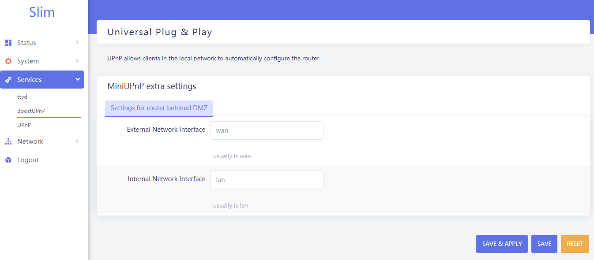
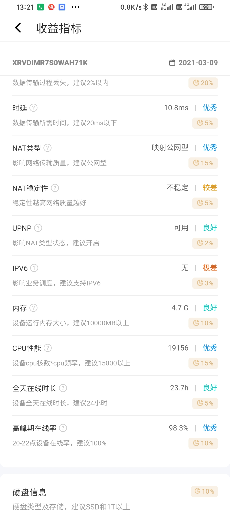
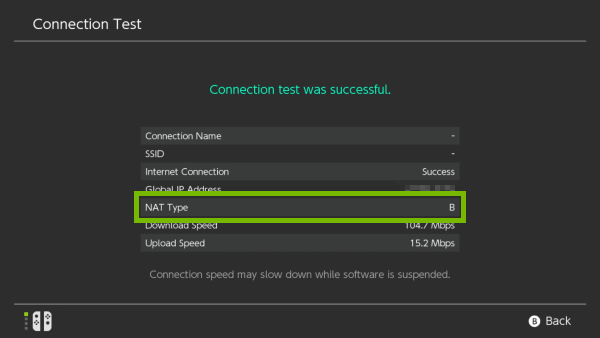
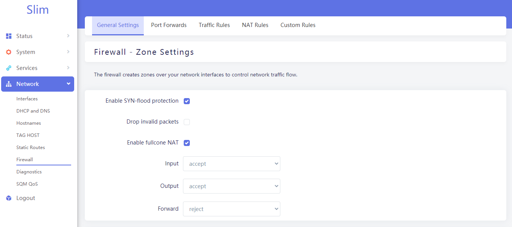

<!--more-->

## 前言

打完洞，布完线，光猫上象征性地测完速，在纸上留下联系方式和账号密码，宽带师傅和我说，好了，搞定了。但是，事实上，家庭网络还有一堆问题在等着我。

我的网络环境和设备如下：

- 上海电信十全十美千兆套餐(升级千兆时光猫换成了SDN设备)
- 2路电信IPTV
- 1路固定电话
- 1台AC 68u
- 1台威联通TS-551
- 1台HP Microserver Gen8
- 1台多口小主机
- iMac/Laptop/智能设备若干
- 有非固定公网IP

## 宽带要不要桥接？

许多人第一要务是把光猫变桥接，由路由器拨号。如果你一个人住，IPTV和固话功能无所谓，不怕折腾，那我支持你把光猫桥接了。

事实是家里有老人爱看个电视，还连着固话，孩子还要时不时上网课，我还是不要桥接了。

光猫拨号至少有几个优点：
- 路由器和光猫独立，路由器的变化不会干扰到电视的收看和电话的使用。我那么爱折腾，还老是尝试新的路由器固件（最近自己在弄slim-wrt）,时不时会影响到家庭网络。如果我是桥接状态的话，我重启路由器家里的电视立刻就没法看了。
- 责任的划分更清晰。电信局端的问题和我家庭内部的问题可以很清晰地划分开。如果我发现上不去网了，只要连接光猫看看网络还是不是通的。如果光猫不通立刻就打电话保修就好了；如果光猫上的设备正常那就是我家庭内部网络的问题。让电信小哥清闲一点，在真的要让他解决问题的时候他才能马力全开——之前被变内网IP找小哥解决第二天就好了。
- 之后的升级可以不受干扰。之后如果我换其他运营商或者光猫设备升级，我的家庭网络可以保持原有的结构不变。

## 不桥接怎么做端口映射？


光猫拨号，下面再接路由器的话，家庭网络就有两级NAT了。这种情况下，常规的方法是做两次端口映射。
比如，我有一台群晖。
[ ]TODO: 添加图例

我的做法是设置DMZ

> 在一些家用路由器中，DMZ是指一部所有端口都暴露在外部网络的内部网络主机，除此以外的端口都被转发。

[ ]TODO: 添加图例

## DMZ下的upnp感觉有问题？

之前用Merlin系统的时候，一些CDN挖矿的软件经常报告我说Upnp没有开启。换了软路由后，刷了iKuai和Openwrt干脆一直说我Upnp没有开启了。

甜糖检测时候的日志如下：

```
2021-01-15 00:35:33.671 GetExternalIpAddress send POST /ctl/IPConn HTTP/1.1
HOST: 192.168.2.1:5000
Content-Length: 274
CONTENT-TYPE: text/xml;charset="utf-8"
SOAPACTION: "urn:schemas-upnp-org:service:WANIPConnection:1#GetExternalIPAddress"

<s:Envelope xmlns:s="http://schemas.xmlsoap.org/soap/envelope/" s:encodingStyle="http://schemas.xmlsoap.org/soap/encoding/">
<s:Body>
<u:GetExternalIPAddress xmlns:u="urn:schemas-upnp-org:service:WANIPConnection:1">
</u:GetExternalIPAddress>
</s:Body>
</s:Envelope>

2021-01-15 00:35:33.677 GetExternalIpAddress recv = HTTP/1.1 200 OK
Content-Type: text/xml; charset="utf-8"
Connection: close
Content-Length: 357
Server: OpenWRT/OpenWrt UPnP/1.1 MiniUPnPd/2.0
Ext:

<?xml version="1.0"?>
<s:Envelope xmlns:s="http://schemas.xmlsoap.org/soap/envelope/" s:encodingStyle="http://schemas.xmlsoap.org/soap/encoding/"><s:Body><u:GetExternalIPAddressResponse xmlns:u="urn:schemas-upnp-org:service:WANIPConnection:1"><NewExternalIPAddress>192.168.2.1</NewExternalIPAddress></u:GetExternalIPAddressResponse></s:Body></s:Envelope>
2021-01-15 00:35:33.677 router ip = 192.168.2.1,external ip = 192.168.2.1
```
**external ip = 192.168.2.1**，外部IP看着不对啊！

翻看一下miniupnpd的文档，有两项值得注意：

- **external_iface**:External interface. The default is to autodetect the first interface with a default route, which usually is wan.

- **external_ip**:Manually specified external IP - if not specified the default ipv4 address of the external interface is used.

很显然，这是DMZ带来的副作用。桥接后路由器拨号的话，路由器的WAN口可以正常地得到外网地址。但是在DMZ之后的路由器，它的WAN口获得的是光猫给分配的内网地址。被指定为DMZ的那个路由器，它接管了几乎所有的网络入口功能，它是事实上对外的唯一网关，但是它自己不知道！它依然认为自己只是一个卑微的二级路由器而已。
我的做法是，写个插件(包含在slim-wrt中，名字叫boostupnp)，让它知道自己多厉害。

- 指定external_iface和internal_iface
- 指定真实的external_ip



使用插件之后upnpd配置如下，补全了原来没有的**external_ip**和**external_iface**

```shell
root@Slim:/# cat /etc/config/upnpd 

config upnpd 'config'
        option download '1024'
        option upload '512'
        option internal_iface 'lan'
        option port '5000'
        option upnp_lease_file '/var/run/miniupnpd.leases'
        option igdv1 '1'
        option ext_ip_reserved_ignore '1'
        option external_iface 'wan'
        option uuid '431ba314-25c0-40e2-bf58-b0bc07ebca1c'
        option clean_ruleset_threshold '90'
        option presentation_url 'http://192.168.2.1/'
        option enabled '1'
        option external_ip '124.77.xxx.xxx' #此处隐去真实IP

config perm_rule
        option action 'allow'
        option ext_ports '1024-65535'
        option int_addr '0.0.0.0/0'
        option int_ports '1024-65535'
        option comment 'Allow high ports'

config perm_rule
        option action 'deny'
        option ext_ports '0-65535'
        option int_addr '0.0.0.0/0'
        option int_ports '0-65535'
        option comment 'Default deny'
```

配合boostupnp，我的upnp环境终于得到了CDN挖矿软件的认可。




## NAT type要选择哪种？

在Merlin系统上，NAT type有两种选择，全锥型和对称型。直观来说，任天堂Switch的网络检测里，NAT Type A对应的就是全锥形；B对应的是对称形。AB两种都能进行联机游戏，但是普遍认为A好于B，B好于C和D，C和D几乎没法玩。



Play Station,XBox也有类似的要求。要求最过分的是那些CDN挖矿软件，他们希望有全锥型，直接挖矿的机器拨号更佳，最好直接把矿机塞到电信机房去。

切换到了Openwrt后发现，它根本没有全锥型这个选项。Slim-wrt里把官方没加的Fullcone功能给加上了。



总结来说，要玩联机游戏，有P2P(BT/PT)需求，尽量上全锥型。没有需求的话，哪种类型都无所谓。


## 有没有必要做双软路由？

如果每天只是刷刷抖音，看看微博，根本不需要（这部分人根本不会看到这里吧）。
我需要，但是不是双软路由。事实上我需要的是两个网关，他们针对不同的网络。他们不必以软路由的形式存在。
- 网关A：日常娱乐用，可以看看网页，打打游戏。
- 网关B：学习用，比如维护我的github页面，查查资料。